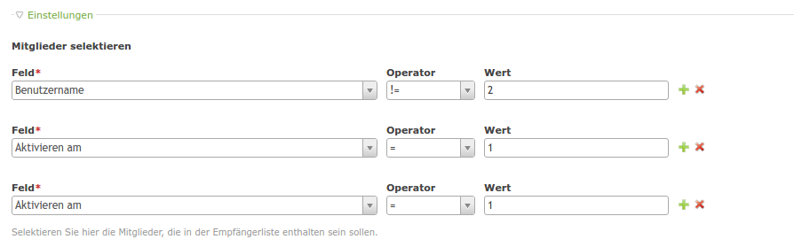

# Multi Column Editor

This module offers an input type for editing one or more records in backend and frontend (not yet implemented, but planned).

The module is similar to [menatwork/MultiColumnWizard](https://github.com/menatwork/MultiColumnWizard) but it is planned to be working in frontend also.



## Features

### Technical instructions

Use the inputType "multiColumnEditor" for your field.

```
'client_logo' => array(
    'label'     => &$GLOBALS['TL_LANG']['tl_my_table']['someField'],
    'inputType' => 'multiColumnEditor',
    'eval'      => array(
        'multiColumnEditor' => array(
            'class' => 'some-class',
            'fields' => array(
                // place your fields here as you would normally in your DCA
            )
        )
    ),
    'sql'       => "blob NULL"
),
```